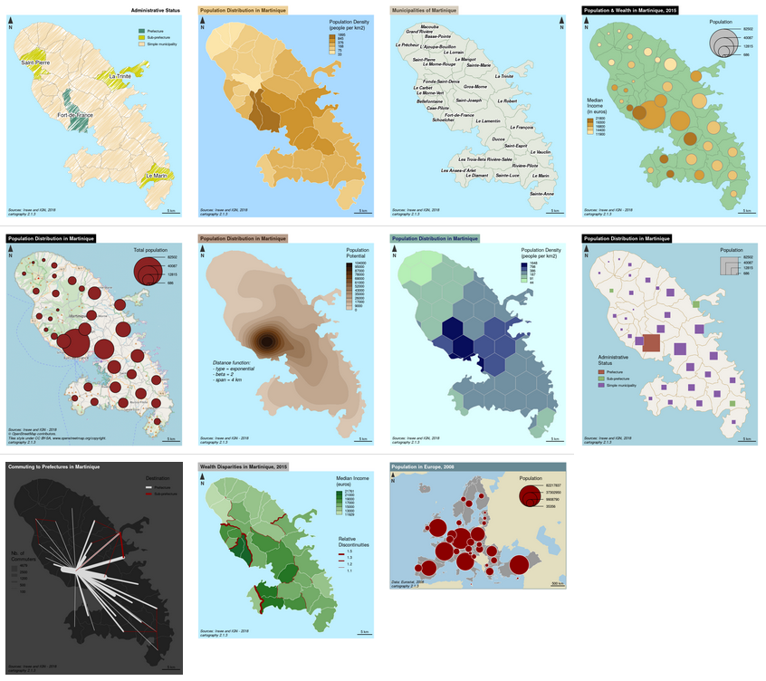
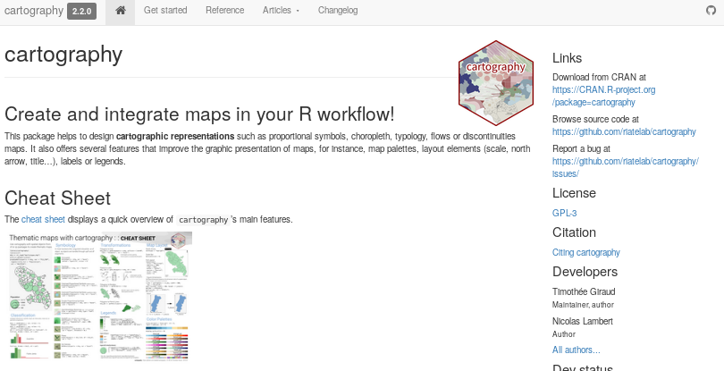

```{r knitr_init, echo=FALSE, cache=FALSE, message=FALSE, error=FALSE, include=FALSE}
## Global options
library(knitr)
library(rmdformats)

## Global options
options(max.print="75")
opts_chunk$set(echo=TRUE,
               cache=TRUE,
               prompt=FALSE,
               tidy=FALSE,
               comment=NA,
               message=FALSE,
               warning=FALSE)
opts_knit$set(width=75)


# no margins
knit_hooks$set(nm = function(before, options, envir){
  if (before){
    par(mar=c(0,0,0,0))
  } 
})

# title margins
knit_hooks$set(sm = function(before, options, envir){
  if (before){
    par(mar=c(0,0,1.2,0))
  } 
})

#Install the github version for date and author
#remotes::install_github("juba/rmdformats")
```

# The R Spatial Ecosystem {.tabset}

## "Historical" Packages

* `rgdal`: interface between R and [GDAL](http://www.gdal.org/) (Geospatial Data Abstraction Library) and [PROJ4](https://github.com/OSGeo/proj.4) libraries: raster / vector geospatial data formats and coordinate transformation.

* `sp`: classes and methods for spatial data in R.

* `rgeos`: interface between R and [GEOS](http://trac.osgeo.org/geos/) (Geometry Engine - Open Source) library: area, perimeter, distances, dissolve, buffer, overlap, union, contains... 


These packages are still widely used. 

## Simple Features for R

* `sf`  Website: [Simple Features for R](https://r-spatial.github.io/sf/index.html)

* First release:  October 20, 2016  

* `sp`, `rgeos` and `rgdal` functionalities in one package. 

* Easier data handling, simpler objects.

* [Tidy data](http://vita.had.co.nz/papers/tidy-data.html): compatibility with the pipe syntax and `tidyverse` operators.

* Main author and maintainer: Edzer Pebesma (also `sp` author)

</br>
**sf objects data structure:**


## Using `sf` {.tabset}

### Data Import {.tabset}
```{r}
library(sf)
mtq <- st_read("data/mtq/martinique.shp")
```

### Projection {.tabset}
Get current crs with `st_crs()` ([epsg code](https://epsg.io/)) and change projection with `st_transform()`.

```{r}
st_crs(mtq)
mtq_4326 <- mtq %>% st_transform(4326)
```


### Data Display
Default plot
```{r, nm=TRUE}
plot(mtq)
```

Only geometry
```{r, nm=TRUE}
plot(st_geometry(mtq))
```


### Centroids Extraction
```{r, nm=TRUE}
mtq_c <- st_centroid(mtq)
plot(st_geometry(mtq))
plot(st_geometry(mtq_c), add=TRUE, cex=1.2, col="red", pch=20)
```

### Distance Matrix
```{r, nm=TRUE}
mat <- st_distance(x=mtq_c,y=mtq_c)
mat[1:5,1:5]
```

### Polygons Aggregation 

Simple union:
```{r, nm=TRUE}
mtq_u <- st_union(mtq)
plot(st_geometry(mtq), col="lightblue")
plot(st_geometry(mtq_u), add=T, lwd=2, border = "red")
```

Aggregation according to a grouping variable:
```{r, nm=TRUE}
library(dplyr)
mtq_u2 <- mtq %>% 
  group_by(STATUT) %>% 
  summarize(P13_POP = sum(P13_POP))
plot(st_geometry(mtq), col="lightblue")
plot(st_geometry(mtq_u2), add=T, lwd=2, border = "red", col=NA)
```

### Buffer Zone
```{r, nm=TRUE}
mtq_b <- st_buffer(x = mtq_u, dist = 5000)
plot(st_geometry(mtq), col="lightblue")
plot(st_geometry(mtq_u), add=T, lwd=2)
plot(st_geometry(mtq_b), add=T, lwd=2, border = "red")
```


### Polygon Intersection 

```{r, nm=TRUE}
# create a polygon
m <- rbind(c(700015,1624212), c(700015,1641586), c(719127,1641586), 
           c(719127,1624212), c(700015,1624212))
p <- st_sf(st_sfc(st_polygon(list(m))), crs = st_crs(mtq))
plot(st_geometry(mtq))
plot(p, border="red", lwd=2, add=T)
```

`st_intersection()` extracts the part of mtq that is intersected by the created polygon. 
```{r, nm=TRUE, warning=F}
mtq_z <- st_intersection(x = mtq, y = p)
plot(st_geometry(mtq))
plot(st_geometry(mtq_z), col="red", border="green", add=T)
```


### Count Points in Polygons  

`st_sample()` creates a set of points contained in mtq. 

```{r , echo = FALSE}
set.seed(1) #To always display the same map.
```

```{r, nm=TRUE}
pts <- st_sample(x = mtq, size = 50)
plot(st_geometry(mtq))
plot(pts, pch = 20, col = "red", add=TRUE, cex = 1)
```

`st_interects()` creates a list of the points within each polygons.

```{r, nm=TRUE}
inter <- st_intersects(mtq, pts)
mtq$nbpts <- sapply(X = inter, FUN = length)
plot(st_geometry(mtq))
# display munucipalities that intersect at least 2 point
plot(st_geometry(mtq[mtq$nbpts>2,]), col = "grey", add=TRUE)
plot(pts, pch = 20, col = "red", add=TRUE, cex = 1)
```


## Other Packages

[CRAN task views](https://cran.r-project.org/web/views/) aim to provide some guidance which packages on CRAN are relevant for tasks related to a certain topic.

[CRAN Task View: Analysis of Spatial Data](https://CRAN.R-project.org/view=Spatial):  

- Classes for spatial data   
- Handling spatial data   
- Reading and writing spatial data   
- Visualisation  
- Point pattern analysis  
- Geostatistics  
- Disease mapping and areal data analysis  
- Spatial regression  
- Ecological analysis  


# Maps with R  {.tabset}


## Overview {.tabset}

Several solutions are available:

- `ggplot2` users can have a look to `ggplot2` mapping features (geom_sf) that can mix nicely with `ggspatial`.  
- For more advanced mapping features in a *ggplot2-like* syntax have a look to `tmap`
- `cartography` is based on base graphics and allow most of basic and advanced cartographic representations.
<br><small>Full disclosure: one of the speakers is the maintainer of `cartography`.</small>
- `mapview`, `leaflet` and `mapdeck` for interactive webmaps.

Here we will focus on `cartography` and do small examples with `ggplot2`, `tmap`, `leaflet` and `mapview`.


### Light Introduction to Graphical Semiology


### Data Preparation

```{r, eval=TRUE,cache=TRUE}
library(sf)
library(dplyr)
# Import geo layers
## Communes of Seine Maritime
sm <- st_read(dsn = "data/dep76/seine_maritime.geojson", 
              stringsAsFactors = FALSE, quiet=TRUE)
## French departements
dep <- st_read(dsn = "data/dep76/dep.geojson", 
               stringsAsFactors = FALSE, quiet=TRUE)

# change projection (lambert93)
sm <- st_transform(sm, 2154)
dep <- st_transform(dep, 2154)

```


```{r, eval=TRUE,cache=TRUE}
# Import dataset  
csp <- read.csv("data/dep76/data_seine_maritime.csv")
# merge geolayer and dataset
sm <- merge(sm, csp, by="INSEE_COM", all.x=TRUE)
head(sm)
```


```{r, eval=TRUE,cache=TRUE}
# Extract a layer of prefecture and sub-prefectures
pref = sm %>% filter(LIBELLE %in% c("Rouen","Le Havre","Dieppe"))
```

`osmdata` allows to extract features from the free and open-source OpenStreetMap database.  

```{r, eval=FALSE,cache=TRUE}
library(osmdata)
# Get major roads from osm
bb      <- sm %>% st_transform(4326) %>% st_bbox()
q       <- opq(bbox = bb,timeout = 180)
qm      <- add_osm_feature (q, key = 'highway',value = 'motorway', value_exact = FALSE)
qt      <- add_osm_feature (q, key = 'highway',value = 'trunk', value_exact = FALSE)
qp      <- add_osm_feature (q, key = 'highway',value = 'primary', value_exact = FALSE)

motorway<- osmdata_sf(qm)
trunk   <- osmdata_sf(qt)
primary <- osmdata_sf(qp)

roads    <- c(primary,trunk,motorway)$osm_lines %>% st_transform(st_crs(sm))
roads.geom = st_intersection(st_geometry(roads),sm) 

# Get the shape of the main river "La seine" 
qr <- q %>% 
  add_osm_feature (key = 'waterway') %>% 
  add_osm_feature(key = "name:fr", value = "La Seine")
river <- osmdata_sf(qr)
river.geom <- st_geometry(river$osm_lines %>% filter(name.fr == "La Seine")) %>%
  st_transform(st_crs(sm))

# Export road and river layers to shapefile
st_write(roads.geom, dsn = "data/dep76/road.shp")
st_write(river.geom, dsn = "data/dep76/river.shp")
```

```{r , echo = FALSE}
roads.geom <- st_read(dsn = "data/dep76/road.shp", quiet = TRUE)
river.geom <- st_read(dsn = "data/dep76/river.shp", quiet = TRUE)
```

```{r, eval=TRUE,cache=TRUE, fig.height=4.75}
# the bbox is used to center the map on the Seine Maritime depatement
bb <- st_bbox(sm)
par(mar=c(0.2,0.2,1.4,0.2), bg="azure")
plot(st_geometry(dep), col = "ivory", border="ivory3", 
     xlim = bb[c(1,3)], ylim =  bb[c(2,4)])
plot(st_geometry(sm), col="cornsilk2", border = NA, lwd = 0.5, add=T)
plot(st_geometry(roads.geom),col="#666666",lwd = 1.2,add=TRUE)
plot(st_geometry(river.geom),col="azure",lwd = 3,add=TRUE)

```

## `cartography` {.tabset}

### Proportional symbols

Simple map:
```{r}
library(cartography)
plot(st_geometry(sm))
propSymbolsLayer(sm, var = "act")
title("Active Population")
```

Custom map:
```{r, fig.height=4.75}
# set the figure margins
par(mar=c(0.2,0.2,1.4,0.2))
# the bbox is used to center the map on the Seine Maritime departement
bb <- st_bbox(sm)
# plot the departements centered on Seine Maritime
plot(st_geometry(dep), col = "ivory", border="ivory3",  bg="azure", 
     xlim = bb[c(1,3)], ylim =  bb[c(2,4)])
# plot municipalities
plot(st_geometry(sm), col="cornsilk2", border = NA, add=T)
# plot roads
plot(st_geometry(roads.geom),col="#666666",lwd = 1.2,add=TRUE)
# plot rivers
plot(st_geometry(river.geom),col="azure",lwd = 3,add=TRUE)
# plot symbols proportionnal to the active popylation
propSymbolsLayer(
  x = sm, 
  var = "act",
  inches = 0.6,
  symbols = "square",
  col="darkblue",  
  border = "white", 
  lwd = 0.7, 
  legend.style = "e", 
  legend.pos="topleft",
  legend.title.txt = "Labor Force\n(2014)", 
  legend.values.rnd = 0
)
# plot prefecture and subprefectures labels
labelLayer(
  x = pref, 
  txt = "LIBELLE", 
  halo = TRUE,
  col = "white", 
  bg = "black", 
  cex = c(.8,.8,1)
) 
# plot a north arrow
north(pos = "topright", col = "darkblue")
# plot a full layout (title, sources, authors, scalebar)
layoutLayer(
  title = "Workforce in Seine-Maritime", 
  sources = "Insee, 2018, OpenStreetMap contributors",
  author = "Kim, Tim & Comeetie, 2019", 
  col = "darkblue", 
  coltitle = "white", 
  tabtitle = TRUE, 
  scale = 10
)
```

### Typology Map

```{r, fig.height=4.75}
# modalities
mod <- c("agr", "art", "cad", "int", "emp", "ouv")
# labels in the legend
modlab <- c("Agriculteurs", "Artisans","Cadres", "Prof. Inter.", "Employés", "Ouvriers")
# colors
cols <- c("#e3b4a2", "#a2d5d6", "#debbd4", "#b5dab6", "#afc2e3", "#e9e2c1")

par(mar=c(0.2,0.2,1.4,0.2))
plot(st_geometry(dep), col = "ivory", border="ivory3", bg="azure",
     xlim = bb[c(1,3)], ylim =  bb[c(2,4)])
typoLayer(
  x = sm, 
  var = "cat",
  col = cols,
  border = "ivory", 
  lwd = 0.5, 
  legend.values.order = mod,
  legend.pos = "n", 
  add=TRUE
)
plot(st_geometry(river.geom),col="azure",lwd = 3,add=TRUE)
plot(st_geometry(roads.geom),col="#666666",lwd = 1.2,add=TRUE)
labelLayer(pref, txt = "LIBELLE", halo = TRUE, 
           col = "white", bg = "black", cex = c(.8,.8,1)) 
# legend* functions are dedicated to legend display
legendTypo(title.txt = "Dominant Socio-Professional\nCategory", 
           col = cols, 
           categ = modlab, 
           nodata = F)
north(pos = "topright", col = "darkblue")
layoutLayer(title = "Workforce Distribution in Seine-Maritime", 
            sources = "Insee, 2018, OpenStreetMap contributors",
            author = "Kim, Tim & Comeetie, 2019", 
            theme = "kaki.pal", tabtitle = TRUE,
            scale = 10)
```


### Choropleth Map

```{r, fig.height=4.75, cache=TRUE}
# Compute the share of "managers" in the active population
sm$pcad <- 100 * sm$cad / sm$act

# Create the map
par(mar=c(0.2,0.2,1.4,0.2))
plot(st_geometry(dep), col = "ivory", border="ivory3", bg="azure",
     xlim = bb[c(1,3)], ylim =  bb[c(2,4)])
choroLayer(
  x = sm, 
  var = "pcad", 
  method = "quantile", 
  nclass = 6,
  col = carto.pal("green.pal", 3,"wine.pal",3),
  lwd = 0.4, 
  border = "grey80", 
  legend.values.rnd = 1, 
  legend.horiz = TRUE,
  legend.pos = "topleft", 
  legend.title.txt = "Share of managers (%)", 
  add=TRUE
)
plot(st_geometry(river.geom),col="azure",lwd = 3,add=TRUE)
plot(st_geometry(roads.geom),col="#666666",lwd = 1.2,add=TRUE)
# functions are dedicated to legend display
labelLayer(pref,txt="LIBELLE",halo=TRUE,col="white",bg="black",cex=.9) 
# Add a layout
layoutLayer(title = "Managers Distribution in Seine Maritime", 
            sources = "Insee, 2018, OpenStreetMap contributors",
            author = "Kim, Tim & Comeetie, 2019", 
            theme = "green.pal", 
            col = "darkred", coltitle = "white", 
            tabtitle = TRUE, 
            frame = TRUE, scale = 10)
north(pos = "topright")

```


We could create the same map on a cartogram based on the active population stock. 

```{r, fig.height=4.75, cache = T}
library(cartogram)
sm_c1 <- cartogram_cont(x = sm, weight = "act", prepare = "none")

# The getBreaks() function is used to classify the variable
bks <- getBreaks(v = sm$pcad, method = "quantile", nclass = 6)
# The carto.pal() function give access to various cartographic color palettes
cols <- carto.pal("green.pal", 3,"wine.pal",3)


par(mar=c(0.2,0.2,1.4,0.2))
plot(st_geometry(dep), col = "ivory", border="ivory3", bg="azure", 
     xlim = bb[c(1,3)], ylim =  bb[c(2,4)])
choroLayer(
  x = sm_c1, 
  var = "pcad", 
  breaks = bks, 
  col = cols, 
  border = "grey80",            
  legend.values.rnd = 1, legend.horiz = TRUE,
  lwd = 0.4, legend.pos = "topleft", 
  legend.title.txt = "Share of managers (%)", add=TRUE
)
# functions are dedicated to legend display
labelLayer(sm_c1 %>% filter(LIBELLE %in% pref$LIBELLE), txt="LIBELLE", 
           halo=TRUE, col="white",
           bg="black", cex=1) 
# Add a layout
layoutLayer(title = "Managers Distribution in Seine Maritime", 
            sources = "Insee, 2018",
            author = "Kim, Tim & Comeetie, 2019", 
            theme = "green.pal", 
            col = "darkred", coltitle = "white", 
            tabtitle = TRUE, 
            frame = TRUE, scale = 10)
north(pos = "topright", south = TRUE)
```


### Gridded Map

```{r, fig.height=4.75, cache = T}
# Create a grid based on sm (cell area = 4 square km)
grid <- getGridLayer(
  x = sm, 
  cellsize = 4000*4000, 
  type = "regular", 
  var = c('cad', 'act')
)
# Compute the share of managers
grid$pcad <- 100 * grid$cad / grid$act
# Display the map as choropleth layer
par(mar=c(0.2,0.2,1.4,0.2))
plot(st_geometry(dep), col = "ivory", border="ivory3", bg="azure", 
     xlim = bb[c(1,3)], ylim =  bb[c(2,4)])
choroLayer(grid, var = "pcad", breaks=bks, 
           col = cols, border = "grey80", 
           lwd = 0.4, legend.pos = "topleft", 
           legend.title.txt = "Share of managers\n(en %)", add=T)
plot(st_geometry(river.geom),col="azure",lwd = 3,add=TRUE)
plot(st_geometry(roads.geom),col="#666666",lwd = 1.2,add=TRUE)
labelLayer(pref,txt="LIBELLE",halo=TRUE,col="white",bg="black",cex=.9) 
layoutLayer(title = "Managers Distribution in Seine Maritime", 
            sources = "Insee, 2018, OpenStreetMap contributors",
            author = "Kim, Tim & Comeetie, 2019", 
            theme = "green.pal", 
            col = "darkred", coltitle = "white", 
            tabtitle = TRUE,
            frame = TRUE, scale = 10)
north(pos = "topright")

```

It is also possible to create hexagonal grids.

```{r, fig.height=4.75, cache = T}
# Create a grid based on sm (cell area = 4 square km)
grid2 <- getGridLayer(x = sm, cellsize = 4000*4000, 
                      type = "hexagonal", var = c('cad', 'act'))
# Compute the share of managers
grid2$pcad <- 100 * grid2$cad / grid2$act
# Display the map as choropleth layer
par(mar=c(0.2,0.2,1.4,0.2))
plot(st_geometry(dep), col = "ivory", border="ivory3", bg="azure", 
     xlim = bb[c(1,3)], ylim =  bb[c(2,4)])
choroLayer(grid2, var = "pcad", breaks=bks, 
           col = cols, border = "grey80", 
           lwd = 0.4, legend.pos = "topleft", 
           legend.title.txt = "Share of managers\n(en %)", add=T)
plot(st_geometry(river.geom),col="azure",lwd = 3,add=TRUE)
plot(st_geometry(roads.geom),col="#666666",lwd = 1.2,add=TRUE)
labelLayer(pref,txt="LIBELLE",halo=TRUE,col="white",bg="black",cex=.9) 
layoutLayer(title = "Managers Distribution in Seine Maritime", 
            sources = "Insee, 2018, OpenStreetMap contributors",
            author = "Kim, Tim & Comeetie, 2019", 
            theme = "green.pal", 
            col = "darkred", coltitle = "white", 
            tabtitle = TRUE,
            frame = TRUE, scale = 10)
north(pos = "topright")

```


### Smoothed Map

`smoothLayer()` uses functions from package [`SpatialPosition`](https://CRAN.R-project.org/package=SpatialPosition) to compute 
Stewart's potentials of population.  
The computation of potentials could be considered as a **spatial interpolation method** 
such as inverse distance weighted interpolation (IDW) or kernel density estimator. 
These models aim to estimate unknown values of non-observed points from known 
values given by measured points. Cartographically speaking, they are often used 
to get a continuous surface from a set of discrete points. 

```{r, fig.height=4.75, cache=TRUE}
sm$cad100 <- sm$cad * 100
par(mar=c(0.2,0.2,1.4,0.2), bg="azure")
plot(st_geometry(dep), col = "ivory", border="ivory3", 
     xlim = bb[c(1,3)], ylim =  bb[c(2,4)])
smoothLayer(
  x = sm, var = "cad100", var2 = "act", 
  typefct = "exponential", span = 4000, beta = 2, 
  breaks = bks, col = cols,
  legend.pos = "topleft", mask = sm,
  legend.values.rnd = 1,
  legend.title.txt = "Share of managers* (%)", 
  border = "grey90", lwd = 0.2, add = TRUE
)
plot(st_geometry(river.geom),col="azure",lwd = 3,add=TRUE)
plot(st_geometry(roads.geom),col="#666666",lwd = .8,add=TRUE)
labelLayer(pref,txt="LIBELLE",halo=TRUE,col="white",bg="black",cex=.9) 
layoutLayer(title = "Managers Distribution in Seine Maritime", 
            sources = "Insee, 2018, OpenStreetMap contributors",
            author = "Kim, Tim & Comeetie, 2019", 
            theme = "green.pal", 
            col = "darkred", coltitle = "white", 
            postitle = "center",
            frame = TRUE, scale = 10)
north(pos = "topright")
text(x = 488000, y = 6921000,adj = 0,
     font = 3, cex = 0.8,
     labels = "* Potential smoothing\n  exponential function\n  span = 4 km, beta = 2")

```


### Resources

* A [cheat sheet](http://riatelab.github.io/cartography/vignettes/cheatsheet/cartography_cheatsheet.pdf) displays a quick overview of `cartography`'s main features:  
[](http://riatelab.github.io/cartography/vignettes/cheatsheet/cartography_cheatsheet.pdf)

* A [vignette](https://cran.r-project.org/web/packages/cartography/vignettes/cartography.html) introduces the package and provides examples of how to create some thematic maps:  
[](https://cran.r-project.org/web/packages/cartography/vignettes/cartography.html)

* A [website](http://riatelab.github.io/cartography/docs/) shows the package documentation and vignette:  
[](http://riatelab.github.io/cartography/docs/)


## `ggplot2` and `tmap` {.tabset}

### `ggplot2`

Proportional symbols map

```{r, fig.height=4.75, cache=TRUE}
library(ggplot2)

labgg = pref %>% st_centroid() 
labgg$x = st_coordinates(labgg)[,1]
labgg$y = st_coordinates(labgg)[,2]

ggplot() +
  geom_sf(data = dep, colour = "ivory3",fill = "ivory") +
  geom_sf(data = river.geom, colour = "azure",size=2) +
  geom_sf(data = roads.geom, colour = "#666666",size=0.5) +
  geom_sf(data = sm %>%  st_centroid(),
          aes(size= act), colour="#E84923CC", show.legend = 'point') +
  geom_text(data=labgg,aes(x=x,y=y,label=LIBELLE))+
  scale_size(name = "Active population",
             breaks = c(100,1000,10000),
             range = c(0,20)) +
  coord_sf(crs = 2154, datum = NA,
           xlim = st_bbox(sm)[c(1,3)],
           ylim = st_bbox(sm)[c(2,4)]) +
  theme_minimal() +
  theme(panel.background = element_rect(fill = "azure",color=NA)) +
  labs(title = "Active population",
       caption = "Insee, 2018\nKim, Tim & Comeetie, 2019",x="",y="")
```

Choropleth map

```{r, fig.height=4.75, cache=TRUE}
ggplot() +
  geom_sf(data = dep, colour = "ivory3",fill = "ivory") +
  geom_sf(data = sm, aes(fill = pcad), colour = "grey80") +
  geom_sf(data = river.geom, colour = "azure",size=2) +
  geom_sf(data = roads.geom, colour = "#666666",size=0.5) +
  geom_text(data=labgg,aes(x=x,y=y,label=LIBELLE))+
  scale_fill_gradientn(name = "Share of managers (%)", 
                       values=bks/max(bks),
                       colours = carto.pal("green.pal", 3,"wine.pal",3)) +
  coord_sf(crs = 2154, datum = NA,
           xlim = st_bbox(sm)[c(1,3)],
           ylim = st_bbox(sm)[c(2,4)]) +
  theme_minimal() +
  theme(panel.background = element_rect(fill = "azure",color=NA)) +
  labs(title = "Managers",
       caption = "Insee, 2018\nKim, Tim & Comeetie, 2019",x="",y="")
```

### `tmap`

Proportional symbols map
```{r, fig.height=4.75, cache=TRUE}
library(tmap)
tm_shape(dep, bbox = st_bbox(sm)) + 
  tm_polygons(col = "ivory", border.col = "ivory3")+
  tm_shape(roads.geom) + 
  tm_lines(col="#666666",lwd = 1.2) +
  tm_shape(river.geom) +
  tm_lines(col="azure",lwd = 3) + 
  tm_shape(sm)  +
  tm_polygons(col="cornsilk2", border.alpha = 0) +
  tm_shape(river.geom) +
  tm_lines(col="azure",lwd = 3) + 
  tm_shape(sm)  +
  tm_symbols(size = "act", col = "darkblue",
             scale = 4,
             title.size = "Active Population") +
  tm_compass(type = "arrow", position = c("right", "top")) +
  tm_scale_bar(position = c("right", "bottom"), breaks = c(0,5,10)) + 
  tm_credits("Insee, 2018
Kim, Tim & Comeetie, 2019", position = c("left", "bottom")) +
  tm_layout(title = "Workforce in Seine-Maritime")

```

Choropleth map

```{r, fig.height=4.75, cache=TRUE}

library(tmap)
tm_shape(dep, bbox = st_bbox(sm)) + 
  tm_polygons(col = "ivory", border.col = "ivory3")+
  tm_shape(roads.geom) + 
  tm_lines(col="#666666",lwd = 1.2) +
  tm_shape(river.geom) +
  tm_lines(col="azure",lwd = 3) + 
  tm_shape(sm)  +
  tm_polygons(col="cornsilk2", border.alpha = 0) +
  tm_shape(river.geom) +
  tm_lines(col="azure",lwd = 3) + 
  tm_shape(sm)  +
  tm_polygons("pcad", 
              breaks = bks,
              palette=cols, title = "Share of Managers") +
  tm_compass(type = "arrow", position = c("right", "top")) +
  tm_scale_bar(position = c("right", "bottom"), breaks = c(0,5,10)) + 
  tm_credits("Insee, 2018
Kim, Tim & Comeetie, 2019", position = c("left", "bottom")) +
  tm_layout(title = "Managers in Seine-Maritime")

```

## `mapview` and `leaflet` {.tabset}

### Proportional symbols layer

These interactive maps, as appealing as they seem to be, are not really suitable for presenting geostatistical information.

For proportional symbols both `leaflet` and `mapview` lack a proper way to build legends. Nonetheless, they can be really useful for exploratory data analysis.

Both librairies are quite similar with some advantage for `mapview` (e.g the possibility to render to canvas for bigger datasets) and some other for `leaflet` (e.g using a customized projection different from web-mercator). 

Two other packages `mapdeck` and `leafgl` deserve attention since they enable mapdrawing in webgl and therefore can be used with large datasets. They are not introduced here but keep them in mind if needed.


```{r, cache=TRUE}
library(mapview)
# convert polygon to point and compute the circle radius for porportional area
actifs = sm %>% st_centroid() %>% mutate(radius = sqrt(act)) %>% arrange(desc(act))
# build a map by providing a map tile provider and some options for the circles.
# with mapview the circle size will stay constant whatever the zoom level is.
mapview(actifs, map.types = "Stamen.TonerLite", cex="radius", legend=FALSE,
        col.regions="#217844", lwd=0, alpha=0.4)
```


With `leaflet` data must be provided in long/lat (st_transform(4326)) and will be converted by default to the webmercator coordinate reference system (CRS).

You may choose between circles with radius specified in meters (addCircle) or in pixels (addCircleMarkers). If specified in pixel, the radius will stay the same whatever the zoom level is. If specified in meters, it will evolve with zoom level.


```{r, cache=TRUE}
library(leaflet)
leaflet(actifs %>% st_transform(4326)) %>% addProviderTiles(providers$Stamen.TonerLite) %>%
  addCircles(radius = ~radius * 30, popup = ~paste0(LIBELLE," : ",act,"actifs"),
             fillColor = "#217844", stroke = FALSE, fillOpacity = 0.4)
```


### Gridded Map

`mapview` and `leaflet` enable the use and styling of sf polygons. We may for example reuse the grid built previously to show the share of managers in Seine-Maritime.

Default choropleth can be obtained with just three arguments with `mapview`. 


```{r}
mapview(grid,map.types = "Stamen.TonerLite",zcol="pcad")
```


`leaflet` enables fine tuning of the color scale and legend.


```{r, cache=TRUE}
# define a color scale function from colors and breaks
color.scale <- colorBin(cols, domain = range(bks), bins=bks)

leaflet(grid  %>% st_transform(4326)) %>% addProviderTiles(providers$Stamen.TonerLite) %>%
  addPolygons(fillColor = ~color.scale(pcad), stroke = FALSE, fillOpacity = 0.7) %>% 
  addLegend(colors = cols, labels = round(bks[1:(length(bks)-1)]*10)/10,
            title = "Share of Manager (%)")

```


### Projection

`leaflet` enables to use other projections than the web-mercator projection for webmaps. You may deal with tiles built with another projection system such as Lambert 93 by defining a custom leaflet crs (see gis.stackexchange [resolution-from-wmts-getcapacilities-scaledenomin](https://gis.stackexchange.com/questions/153640/proj4leaflet-create-crs-scales-resolution-from-wmts-getcapacilities-scaledenomin) and [mathematics-behind-converting-scale-to-resolution](https://gis.stackexchange.com/questions/153640/proj4leaflet-create-crs-scales-resolution-from-wmts-getcapacilities-scaledenomin) to deal with WMTS tiles).

We use this approach here to deal with Hypsometric tints tiles (tiles colors which encode elevation) and the contour lines of chamois and ibex population area provided by the [french national office of hunting and wild animals](http://www.oncfs.gouv.fr/Cartographie-ru4/Le-portail-cartographique-de-donnees-ar291).


```{r}
epsg2154 <- leafletCRS(crsClass = "L.Proj.CRS", code = "EPSG:2154",
                       proj4def = "+proj=lcc +lat_1=49 +lat_2=44 +lat_0=46.5 +lon_0=3
                       +x_0=700000 +y_0=6600000 +ellps=GRS80 +towgs84=0,0,0,0,0,0,0
                       +units=m +no_defs",
                       resolution = 4838095.23807/cumprod(c(1,rep(2,15)))*0.00028,
                       origin= c(-357823.2365,7230727.3772)
)


tile_mnt <- "http://tiles.craig.fr/mnt/service?service=WMTS&request=GetTile&version=1.0.0&
layer=relief&style=default&tilematrixset=lambert93&format=image%2Fpng&tilematrix={z}&
tilerow={y}&tilecol={x}"

tile_attrib <- "Map data &copy;
<a href='https://www.craig.fr/contenu/1377-flux-tuile-wmswmtstms'> craig / IGN </a>
and <a href='http://www.oncfs.gouv.fr/Cartographie-ru4/Le-portail-
cartographique-de-donnees-ar291'>ONCF</a>"

bouq = read_sf("./data/BOQ_2017_massif_uni/BOQ_2017_massif_uni_L93.shp")
cha = read_sf("./data/CHA_2017_massif_uni/CHA_2017_massif_uni_L93.shp")

leaflet(options = leafletOptions(worldCopyJump = F, crs = epsg2154)) %>%
  addTiles(urlTemplate = tile_mnt,attribution = tile_attrib) %>% 
  addPolygons(data = bouq %>% st_transform(4326), fillColor = '#50162D',color = '#772A7F',
              fillOpacity = 0.05,opacity = 1, weight = 2.5, dashArray = "3") %>% 
  addPolygons(data = cha %>% st_transform(4326), fillColor = '#88AA00',color = '#CCFF00',
              fillOpacity = 0.05,opacity = 1, weight=2.5, dashArray = "3") %>% 
  setView(2.692174, 45.067230, 4)

```

# <small> reproducibility </small> {.tabset}

Presentation made with `rmdformats` package.

Always share your R and packages configuration!

```{r}
sessionInfo()
```
